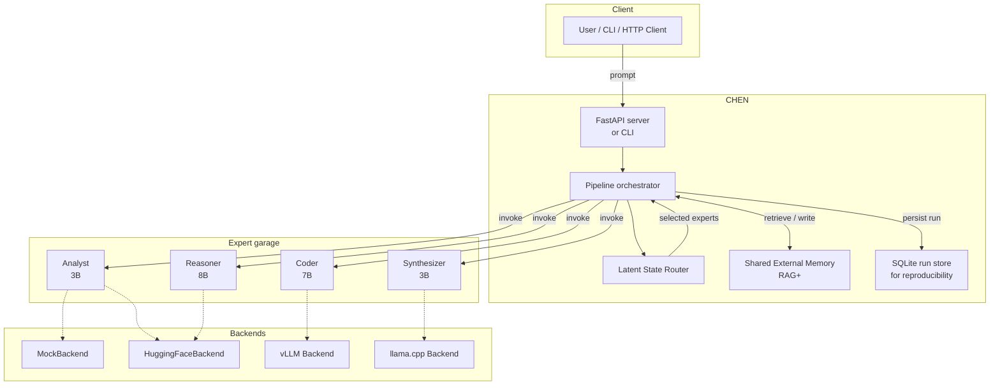
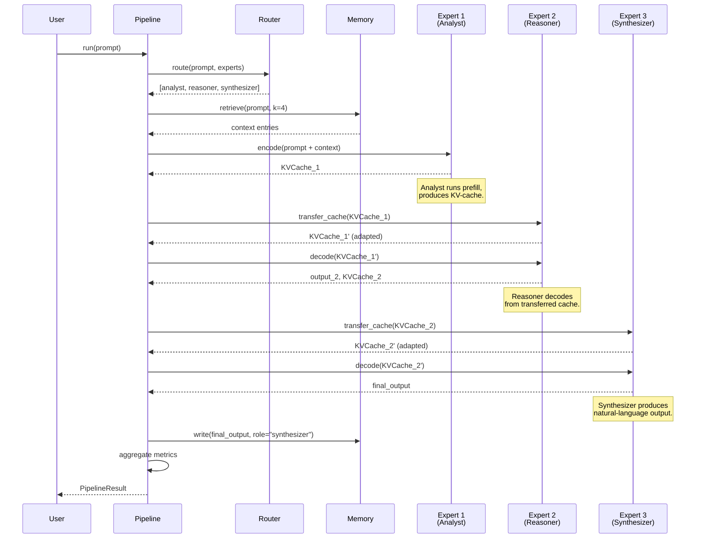
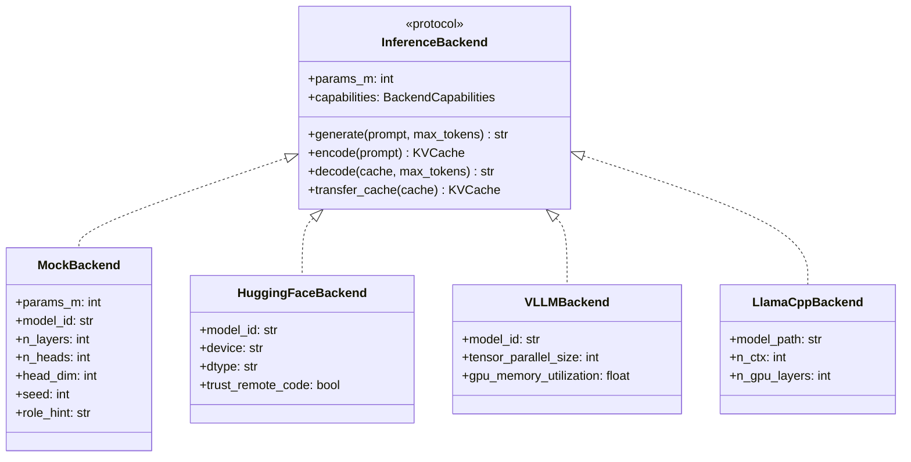
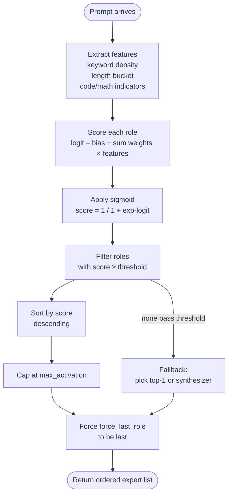
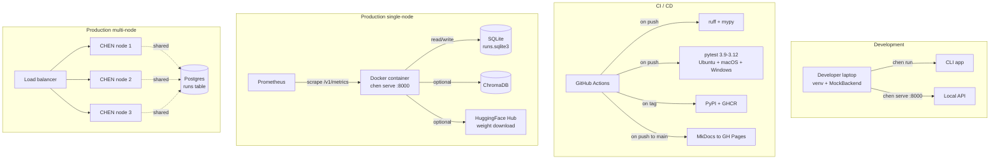
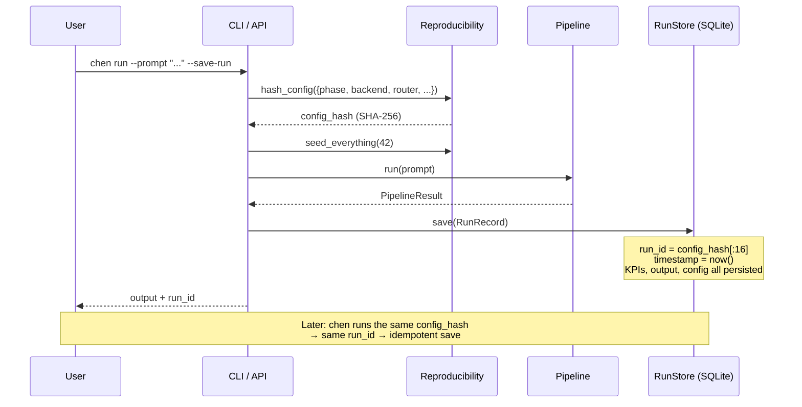
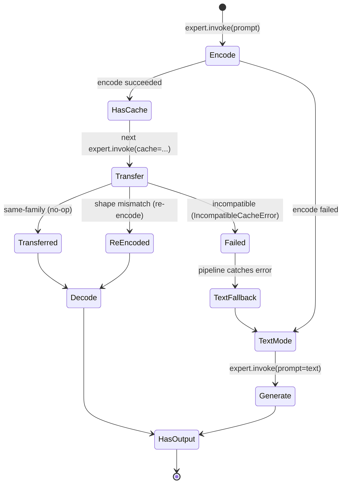

# System Architecture

This document gives a visual overview of CHEN's architecture. For the
prose explanation, see [`ARCHITECTURE.md`](https://github.com/your-org/chen/blob/main/ARCHITECTURE.md). For
formal definitions of KPIs and cost models, see
[`math/specifications.md`](../math/specifications.md).

## 1. High-level topology

## 2. Pipeline data flow (Phase 2 — KV-cache passing)

## 3. Backend abstraction

## 4. Router decision flow

## 5. Deployment topology

## 6. Reproducibility flow

## 7. State machine: KV-cache transfer

